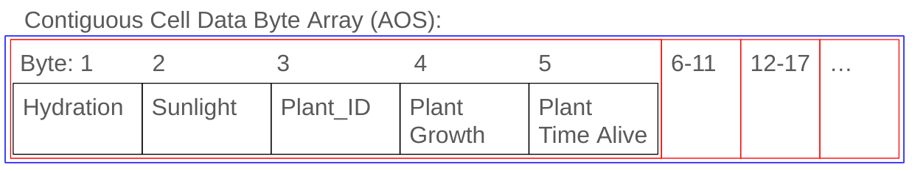

# CMPM-121-Final


## F0 Devlog (11.24.23) [Ben Daly]

Well, Thanksgiving was yesterday -- since a lot of people in the group seem to be going pretty far/flying for the holidays, I figured I'd try to do this log myself since I'm not travelling as much. Video forthcoming.

### How we satisfied the software requirements

### [F0.a] You control a character moving on a 2D grid.
The character is moved via the mouse. Right now, we use the keyboard for actions (Z: Move, X: Plant, C: Harvest), but we keep the mouse being the one to select where you decide to move/plant/harvest an object.
### [F0.b] You advance time in the turn-based simulation manually.
We keep discrete track of "turns" in the upper-left. A turn passes each time the player moves, plants, or harvests a plant.
### [F0.c] You can reap (gather) or sow (plant) plants on the grid when your character is near them.
If the player has moved directly adjacent to a plant, they can press X, select the spot, and harvest it. Plants must be at their final growth space for this to reward points.
If the player is adjacent to an open spot on the grid, they can plant a random plant of three different kinds. Daisies give the least points, strawberries the most, with zucchini in the middle. Points do not have a purpose yet; only the harvesting itself.

### [F0.d] Grid cells have sun and water levels. The incoming sun and water for each cell is somehow randomly generated each turn. Sun energy cannot be stored in a cell (it is used immediately or lost) while water moisture can be slowly accumulated over several turns.
At the beginning of the game, all grass tiles are initialized with a certain water level between (and staying between) 0 and 100. 
A new level of sun (also between 1 and 100) is generated each turn, with a fraction of its value subtracting from the water level.
Finally, each turn, the water level in a tile increases and decreases naturally on its own.

### [F0.e] Each plant on the grid has a type (e.g. one of 3 species) and a growth level (e.g. “level 1”, “level 2”, “level 3”).
There are zucchinis, strawberries, and daisies. Each has three stages, where the third stage is when they can be harvested for points. Before that, they do not count for harvests, and after that, they die. Their phases are tracked by an internal age that updates based on sun and water levels every turn.

Plant growth stages are tracked differently from how many turns they have been alive. After they have been alive for a certain number of turns, they die, regardless of their growth stage.
### [F0.f] Simple spatial rules govern plant growth based on sun, water, and nearby plants (growth is unlocked by satisfying conditions).
Plants grow based on a combination of their current sun and water values. They also grow at a faster rate if there are other plants directly (not diagonally).
If a tile is sunny (flashing lightly) and wet (dark), those are the ideal environments for a plant.

### [F0.g] A play scenario is completed when some condition is satisfied (e.g. at least X plants at growth level Y or above).
The scenario is completed once the player has harvested 5 plants. Again, the points plants yield currently have no purpose, just their acquisition.

### Reflection
I (Ben) really wanted a Fire-Emblem-Like combat system, and maybe we can manage that in the future -- the idea was that zombies/monsters would come from the margins of the screen to attack plants, and you'd have to fight them off while trying to figure out if you could harvest plants in time that would give you buffs.
Godot is pretty weird, and the holiday hit, and so we only got to the bare minimum of requirements. It bummed me out, but what can you do? We scoped smaller.

We had a lot of arguments about using GDScript versus C#, and so far it seems like we made the right decision, but we also have a lot of sloppy getting of data across classes, and we're also using nodes, which the professor recommended against. Since Gabe is the engine lead, he's offered to do this before we start F1, but I don't know if it's feasible.

I've been Design Lead, but I feel like I've been de facto project lead. I don't think Tools has a lot to do right now since Godot's pipeline is kind of already built for you, too, but Reuben did help get the .gitignore properly working.

Here's to hoping we can clean up a bit for F1.

# Devlog Entry - [11/19/2023]
Reuben Chavez: I have create the repo for our final project and have intergrated godot.

## F1 Devlog - [12/6/2023]

### [F0.a] You control a character moving on a 2D grid.
The character is moved via the mouse. Right now, we use the keyboard for actions (Z: Move, X: Plant, C: Harvest), but we keep the mouse being the one to select where you decide to move/plant/harvest an object.
### [F0.b] You advance time in the turn-based simulation manually.
We keep discrete track of "turns" in the upper-left. A turn passes each time the player moves, plants, or harvests a plant.
### [F0.c] You can reap (gather) or sow (plant) plants on the grid when your character is near them.
If the player has moved directly adjacent to a plant, they can press X, select the spot, and harvest it. Plants must be at their final growth space for this to reward points.
If the player is adjacent to an open spot on the grid, they can plant a random plant of three different kinds. Daisies give the least points, strawberries the most, with zucchini in the middle. Points do not have a purpose yet; only the harvesting itself.

### [F0.d] Grid cells have sun and water levels. The incoming sun and water for each cell is somehow randomly generated each turn. Sun energy cannot be stored in a cell (it is used immediately or lost) while water moisture can be slowly accumulated over several turns.
At the beginning of the game, all grass tiles are initialized with a certain water level between (and staying between) 0 and 100. 
A new level of sun (also between 1 and 100) is generated each turn, with a fraction of its value subtracting from the water level.
Finally, each turn, the water level in a tile increases and decreases naturally on its own.

### [F0.e] Each plant on the grid has a type (e.g. one of 3 species) and a growth level (e.g. “level 1”, “level 2”, “level 3”).https://github.com/timpt0261/CMPM-121-Final/blob/master/README.md
There are zucchinis, strawberries, and daisies. Each has three stages, where the third stage is when they can be harvested for points. Before that, they do not count for harvests, and after that, they die. Their phases are tracked by an internal age that updates based on sun and water levels every turn.

Plant growth stages are tracked differently from how many turns they have been alive. After they have been alive for a certain number of turns, they die, regardless of their growth stage.
### [F0.f] Simple spatial rules govern plant growth based on sun, water, and nearby plants (growth is unlocked by satisfying conditions).
Plants grow based on a combination of their current sun and water values. They also grow at a faster rate if there are other plants directly (not diagonally).
If a tile is sunny (flashing lightly) and wet (dark), those are the ideal environments for a plant.

### [F0.g] A play scenario is completed when some condition is satisfied (e.g. at least X plants at growth level Y or above).
The scenario is completed once the player has harvested 5 plants. Again, the points plants yield currently have no purpose, just their acquisition.

### [F1.a] The important state of each cell of your game’s grid must be backed by a single contiguous byte array in AoS or SoA format. Your team must statically allocate memory usage for the whole grid.
To store and retreive our sunlight, water, plant, and player data we use an AoS byte array. We convert our data to bytes when we want to store and decode when we want to retreive.


### [F1.b] The player must be able to undo every major choice (all the way back to the start of play), even from a saved game. They should be able to redo (undo of undo operations) multiple times.
We pack the entire game state into its own byte array and store that into a list of game state arrays after each turn. This list can be traversed up and down to acheive undo and redue. This functionality persists throughout multiple game sessions.

### [F1.c] The player must be able to manually save their progress in the game in a way that allows them to load that save and continue play another day. The player must be able to manage multiple save files (allowing save scumming).
The list of game states as mentioned is packed into its own byte array which is saved in a uniquely named .txt file for each save. When wanting to load saved data the associated file is retreived and unpacked.

### [F1.d] The game must implement an implicit auto-save system to support recovery from unexpected quits. (For example, when the game is launched, if an auto-save entry is present, the game might ask the player "do you want to continue where you left off?" The auto-save entry might or might not be visible among the list of manual save entries available for the player to load as part of F1.c.)

Autosaving is achieved by checking how much time has passed, and if it goes over our preset autosave time an auto save is made. This is stored and accessed the same way normal saves are.

### Reflection
In order to adapt to this requirement our team had to refactor a bit. We ended up storing our byte array in our farm_grid script which handled saving all necessary cell data. We also removed our plant_manager completely, delegating our plant relating tasks to terrain_map.

## F2 Devlog (12.11.23) [Reuben Chavez]

### F0+F1

Our game continues to meet both the requirements for F0 + F1 while still implementing the same game mechanics as required in F0. Additionally, we continue to rely on the packed byte array to save, load, undo, and redo our game state.

### External DSL for Scenario Design

Using a JSON file, we set it up with information for our winning conditions, specifically when the player reaches a score of 100 points.

```JSON
{
	"points_to_win": 100
}
```

In the game state manager, we read the file and update to see if the conditions are met:

```python
func _ready():
	terrain_map.increment_score.connect(increment_score.bind())
	victory_score = get_victory_score("res://data/victory.json")
```

### Internal DSL for Plants and Growth Conditions

Gabe created an internal DSL in the same style as the code example Adam gave us. We have a set of methods we can call to write a "program" in the form of a function - you can see that in the `plant_template_programs` list in `PlantTemplates`.

```python
# plant_template.gd
class_name PlantTemplate

var id: int
var name: String
var points: int
var texture: Texture2D
var growth_caps: Array[int]
var max_turns: int
var grow: Callable

```

```python
# plant_templates.gd
class_name PlantTemplates

static var template_programs: Array[Callable] = [
    func(dsl: PlantTemplateDSL):
        dsl.id(0)
        dsl.name("Daisy")
        dsl.points(3)
        dsl.texture(load("res://sprite/daisy.png"))
        dsl.growth_caps([2, 5, 25])
        dsl.max_turns(30)
        dsl.grow(func(ctx: GrowthContext):
            var water_ratio = ctx.hydration / 100.0
            if ctx.adjacent_plant_ids.is_empty():
                return
            ctx.plant.growth += 3 * (1.0 / ctx.adjacent_plant_ids.size())),
    func(dsl: PlantTemplateDSL):
        dsl.id(1)
        dsl.name("Strawberry")
        dsl.points(7)
        dsl.texture(load("res://sprite/strawberry.png"))
        dsl.growth_caps([2, 6, 25])
        dsl.max_turns(35)
        dsl.grow(func(ctx: GrowthContext):
            var water_ratio = ctx.hydration / 100.0
            ctx.plant.growth += 3 * (-pow(2 * water_ratio - 1, 2) + 1)
            print("Total: " + str(ctx.plant.growth))),
    func(dsl: PlantTemplateDSL):
        dsl.id(2)
        dsl.name("Zucchini")
        dsl.points(5)
        dsl.texture(load("res://sprite/zucchini.png"))
        dsl.growth_caps([2, 7, 25])
        dsl.max_turns(32)
        dsl.grow(func(ctx: GrowthContext):
            var water_ratio = ctx.hydration / 100.0
            var sun_ratio = ctx.sunlight / 100.0
            if water_ratio > 0.3 || sun_ratio > 0.5:
                return
            ctx.plant.growth += 3 * (sun_ratio / 0.5)
            print("Total: " + str(ctx.plant.growth)))
]
static var templates: Array[PlantTemplate] = get_compiled_templates()

static func get_templates() -> Array[PlantTemplate]:
    return templates

static func get_compiled_templates() -> Array[PlantTemplate]:
    var templates: Array[PlantTemplate] = []
    templates.resize(template_programs.size())
    for i in template_programs.size():
        templates[i] = PlantTemplateDSLCompiler.compile(template_programs[i])
    return templates

class PlantTemplateDSLCompiler:
    static func compile(program: Callable) -> PlantTemplate:
        var plant_template = PlantTemplate.new()
        
        program.call(PlantCompilerDsl.new(plant_template));
        
        return plant_template
    
class PlantCompilerDsl extends PlantTemplateDSL:
    var plant_template: PlantTemplate
    
    func _init(plant_template):
        self.plant_template = plant_template
        
    func id(id: int):
        plant_template.id = id
    func name(name: String):
        plant_template.name = name
    func points(points: int):
        plant_template.points = points
    func texture(texture: Texture2D):
        plant_template.texture = texture
    func growth_caps(growth_caps: Array[int]):
        plant_template.growth_caps = growth_caps
    func max_turns(max_turns: int):
        plant_template.max_turns = max_turns
    func grow(grow: Callable):
        plant_template.grow = grow
```

```python
# plant_template_dsl.gd
class_name PlantTemplateDSL

func id(id: int):
    assert(false, "name() is an abstract function")
func name(name: String):
    assert(false, "name() is an abstract function")
func points(points: int):
    assert(false, "points() is an abstract function")
func texture(texture: Texture2D):
    assert(false, "texture() is an abstract function")
func growth_caps(growth_caps: Array[int]):
    assert(false, "growth_caps() is an abstract function")
func max_turns(max_turns: int):
    assert(false, "max_turns() is an abstract function")
func grow(context: Callable):
    assert(false, "grow() is an abstract function")
```

The `PlantTemplateCompiler` compiles and runs those programs to build a `PlantTemplate` which stores all shared data of plant types. Each plant type has a grow function which is run each turn. This function determines how each one uniquely grows.

Notably:
- Daisies grow only if they have a neighboring plant but grow slower if you add more than one.
- Strawberries like a moderate amount of hydration.
- Zucchini grows faster with more sun but won't grow if hydration or sunlight goes above 0.3 or 0.5, respectively.

## Reflection

Looking back on how we accomplished F2 requirements, I see that fundamentally when it came to understanding the External DSL, it was mainly building on our understanding of how we have set up our game state manager. While with the internal DSL, it was a lot harder to accomplish due to the limitations of the Godot language while also coming to terms with how to truly implement a program that could create the plant types and refactoring the code around them.

## F3 Devlog (12.11.23) [Reuben Chavez]

### F0+F1+F2

There were no significant changes in the game in terms of implementation. However, we did make a notable change to our save and load functionality to work on an Android phone. The original implementation saved its progress within the game files instead of on the user's device.

### Internationalization

Ben created a UI element that could scroll to different languages, referenced by a JSON file with different names and characters for the strings used in the game:

```JSON
[
	{
		"language": "English",
		"move": "Move",
		"plant": "Plant",
		"harvest": "Harvest",
		"turn": "Turn",
		"score": "Score",
		"save": "Save",
		"load": "Load",
		"autosave": "AutoSave",
		"undo": "Undo",
		"redo": "Redo",
		"lang": "Language"
	},
	{
		"language": "Español",
		"move": "Mover",
		"plant": "Plantar",
		"harvest": "Cosechar",
		"turn": "Turno",
		"score": "Puntos",
		"save": "Guardar",
		"load": "Cargar",
		"autosave": "Autoguardado",
		"undo": "Deshacer",
		"redo": "Rehacer",
		"lang": "Idioma"
	},
	{
		"language": "יידיש",
		"move": "מאַך",
		"plant": "פּלאַנט",
		"harvest": "שניט",
		"turn": "זוג",
		"score": "פּונקט",
		"save": "שפּעיך",
		"load": "לאַדן",
		"autosave": "אַווטאָסעיוו",
		"undo": "אויסרעטן",
		"redo": "רעטורן",
		"lang": "שפּראַך",
	},
	{
		"language": "日本語",
		"move": "動く",
		"plant": "植える",
		"harvest": "収穫する",
		"turn": "番",
		"score": "点",
		"save": "セーブ",
		"load": "ロード",
		"autosave": "オートセーブ",
		"undo": "元に戻す",
		"redo": "やり直し",
		"lang": "言語",
	}
]
```

Then our game state manager would change the text of all the UI elements to their respective language:

```python
func init_language_options(file_path: String):
	var file = FileAccess.open(file_path, FileAccess.READ)
	lang_data = JSON.parse_string(file.get_as_text())

	for n in range(lang_data.size()):	
		language_options.add_item(lang_data[n].get("language"))
	
	language_options.select(0)
	

func set_language(id):
	print("test")
	
	var lang: Dictionary = lang_data[id]
	save.text = lang.get("save")
	load.text = lang.get("load")
	score_count.translated_text = lang.get("score")
	score_count.translate_score()
	turn_count.translated_text = lang.get("turn")
	turn_count.translate_turn()
	undo.text = lang.get("undo")
	redo.text = lang.get("redo")
	language_label.text = lang.get("lang")
	
	controls_label.text = "Z: " + lang.get("move") + ", X: " + lang.get("plant") + ", C: " + lang.get("harvest");
	
```

### Localization

Essentially, we used ChatGPT, DeepLearning, and also our team's knowledge of their native/secondary languages to create the JSON File above. The game supports English, Spanish, Yiddish, and Japanese. The language setting itself can be changed within the game using a tab icon.

### Mobile Installation

Ideally, I followed [Godot's Android export documentation](https://docs.godotengine.org/en/stable/tutorials/export/exporting_for_android.html). Essentially, it would build our game as an .apk file, and then using a USB-C cable, I would transfer a zip file of the build to my Android phone, where it would then install. The next challenge was to simply get the buttons that would replace the Z, X, C keys from our keyboard, as well as getting the save and load to work on the phone.

### Mobile Play (Offline)

Since the game was built on a game engine, it didn't require the internet to play to begin with. Unless the project itself needs to be updated, all it requires is access to my laptop to update the game.

## Reflection

I definitely will say I had a larger contribution to this step as I worked on getting the game to install on my phone, giving more confidence as a team member. But also how amazing we strided to basically finish a lot of the project in under a day. I have to praise Ben for having set up the internationalization and localization of our game. As well as Ben and Gabe for having worked on the button Android button configuration as well as modifying the load and save on the phone.

## Introducing the Team

### Tools Lead - [Reuben Chavez]
Responsible for researching alternative tools, setting up configurations, and establishing coding style guidelines. Provides support for systems like source control and automated deployment. Also assists in setting up auto-formatting systems.

### Engine Lead - [Gabriel Bacon]
Researches alternative engines and provides direction to team-members on engine-specific syntax. Establishes standards for organizing code into project folders and proposes software designs that insulate the team from underlying engine details.

### Design Lead - [Ben Daly]
Establishes the creative direction of the project, sets the look and feel of the game, and leads discussions on domain-specific language elements. Responsible for creating small art or code samples to help others contribute.

### Production Lead -[Daniel Bustan]
Defines the project scope and deliverable. Responsibilities include but not limited to group scheduling, music production and asset creation. 

## Tools and Materials

### Engines, Libraries, Frameworks, and Platforms
Our team chose to use Godot Engine 4 with GDScript. We made this decision because we wanted to work in an environment that provided a language alternative to Javascript, with the underlying ability to publish to web. We wanted to see how much of our skills from 121 could transfer to another langauge that all of us are a little less familar with.

### Programming and Data Languages
We will be using GDScript for coding, as its an easy-to-read language that allows for web builds. We initially were going to work in C#, but we realized that the potential for a game that can be built for the web is important, and only GDscript provides that.

### Authoring Tools
We plan to use the following tools: Godot Engine Editor, Photoshop, and online resources. We chose these tools as they fit most closely with our encompassing goal while allowing each user a good amount of time to spend on the code. We would rather focus more on the code than the art for this specific project.

## Outlook

### Project Goals
Our team aims to create a Farm Sim game inspired by Fire Emblem. This means that our game will have tile-based movmement with enemies that will attack the farm if not killed before then.

### Project Challenges
The hardest part of this project might be integrating any engine changes Adam makes us do. Since GDscript isn't that complex it might not be too hard, but we may run into issues with texture placement, etc.

### Learning Objectives
By using the selected tools and materials, we hope to learn how to better use the Godot Engine, while . This includes [Specific Skills or Knowledge] that will benefit our team members individually and collectively.

